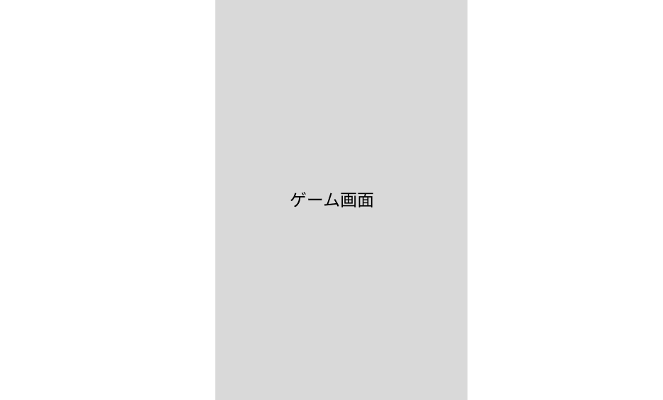
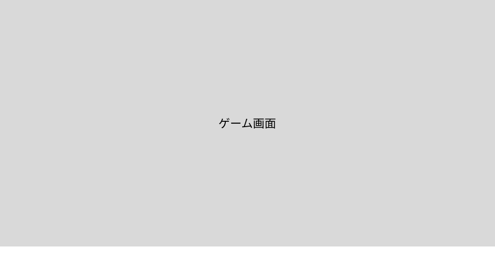

### 開発計画書 Development Plan Document
####　基本情報
***開発計画書連番***

***開発物連番***

***開発物の名前***
ドンドコアドベンチャー（仮）\
**編集者の名前**
井上 佳寿己,秋田　剛志\
**開発期間**
2 month\
**使用する言語、ライブラリ、開発ツール、環境など**
 Unity c#\
**テーマや条件などがある場合は記述**  
unityを使えるようになる。\
**開発物の大まかな内容や対象の説明**  
基本的な機能のみの実装した簡単な不思議なダンジョンゲーム。\
主にunityを使えるようになるための練習がてらに制作。\
ただし、次の開発期間からこれを利用して、どんどんゲームを整えていく予定。

---

#### 詳細情報
**開発物の意義** 
unityについてや、c#などを学べると考えた。\
**開発する理由や動機**
  クオリティの高いゲームを作ってみたかった。\
**画面遷移のイメージ画像と説明**  

今回はゲームの中身を作ることに重きを置くためデバッグをしやすくしたり、時間に余裕を持たせるために画面はいきなりゲームが始まるようにしている。\
**完成像のイメージ画像と説明**  

画面は中央に広く取る予定\
**ディレクトリ構造(ファイル構造)の設計と説明**  
game\
├──character\
　　└(キャラクターについてのファイル)\
└──background\
　　└(背景についてのファイル)\
現段階でこれが決まっています。
**データベースの設計と説明**  
使っていません
**処理の流れやアルゴリズムの説明**  
マスに区切られたフロアを自キャラと敵キャラが歩いている。\
自キャラがアイテムの上に乗るとそのアイテムを拾い、アイテム画面から確認、使用ができる。\
自キャラ・・・矢印キーでその方向に移動移動（8方向）。ダッシュキーを押すことで早く移動ができる。ダッシュ時はアイテムを拾わず、上に乗るだけになる。\
また、移動の代わりに向いている方向に攻撃ができる。\
攻撃キーとダッシュキーの同時押しでターン送りができる。
敵キャラ・・・自キャラに向かって移動（斜め移動優先）。自キャラと隣接しているときに移動できる場合は、自キャラに攻撃を仕掛けてくる。
階段上で「階段を降りる」を選択すると、フロアの状態がリセットされる。

現段階ではこれらの機能実装は予定している。

**デプロイ、リリースとう想定している場合はサーバーやその設定などについて**
特になし